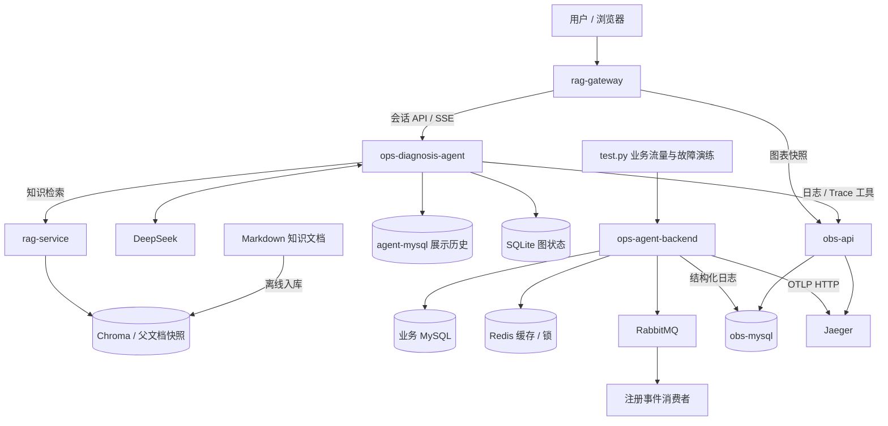

# ops-agent

一个基于 **日志、分布式 Trace 和运维知识库** 的诊断 Agent 项目，使用 Go + Python 开发，通过 Docker Compose 部署。

项目围绕一套接入 MySQL、Redis 和 RabbitMQ 的用户管理业务构建：产生正常流量与可控故障，在可视化面板观察异常并框选时间窗口，再由 LangGraph Agent 调用观测工具、检索知识，分析受影响接口与可能原因。用户可以看到工具调用过程、具体证据与知识引用，也可以继续追问和回看历史。

当前定位是可运行、可演示、可通过故障场景验证的学习项目，诊断工具只读，修复操作由人执行。

## 主要能力

- **分层观测工具**：日志统计、模板、原始记录，以及 Trace 统计、入口摘要和 Span 详情，支持从异常概况逐步下钻。
- **按服务分析**：日志统计可发现多个服务的异常分布；Trace 以指定服务的 server 入口及后代为范围，不要求该入口是整条链路的根。
- **日志与 Trace 联动面板**：日志级别时间桶和请求耗时散点共用选区，支持服务/接口筛选，将时间范围写入诊断草稿。
- **运维知识检索**：向量召回 + CrossEncoder 精排；项目架构和排查手册返回全文，技术资料返回切片，回答可关联知识来源。
- **流式诊断与持久化**：SSE 展示文本和工具事件；MySQL 保存展示历史，SQLite checkpoint 保存 Agent 图上下文，支持取消、历史分页及重复提交识别。
- **可控故障演练**：默认 30 分钟业务流量，穿插 Redis 暂停、MySQL 行锁等待、RabbitMQ 断线和异常请求模式，用实际记录核对诊断结论。

## 架构与仓库

根仓库维护部署编排、项目入口文档和故障演练。五个服务以 Git submodule 管理，各自保存源码、README 和测试。

| 子模块 | 技术与职责 | 详细说明 |
| --- | --- | --- |
| `ops-agent-backend` | Go / Gin / GORM；用户 CRUD、Redis 缓存与更新锁、RabbitMQ 注册事件、日志与链路埋点 | [业务后端](https://github.com/wang-kang-tuoinai/ops-agent-backend/blob/main/README.md) |
| `obs-api` | Go / Gin；查询观测 MySQL 和 Jaeger，提供诊断工具与面板缓存 | [观测 API](https://github.com/wang-kang-tuoinai/obs-api/blob/main/README.md) |
| `ops-diagnosis-agent` | Python / LangGraph / FastAPI；诊断图、工具调用、会话与 SSE | [诊断 Agent](https://github.com/wang-kang-tuoinai/ops-diagnosis-agent/blob/main/README.md) |
| `rag-service` | Python / FastAPI / Chroma / BGE；知识入库、召回、精排和全文/切片返回 | [知识检索](https://github.com/wang-kang-tuoinai/rag-service/blob/main/README.md) |
| `rag-gateway` | Go 反向代理 + 原生 JavaScript / Canvas；聊天与观测面板 | [网关与前端](https://github.com/wang-kang-tuoinai/rag-gateway/blob/main/README.md) |



业务数据、观测日志和对话记录使用独立数据库。模型不直接访问数据库或操作容器，而是通过工具查询观测接口和知识接口。

### 关键设计

**观测数据先整理，再交给模型。** obs-api 负责日志聚合、服务入口选择、状态判断和精简 Span 树。日志 ERROR 数与失败请求数使用不同口径，Trace 的代表性错误也不直接等于根因。候选截断、采集不完整与查询失败会随结果返回。

**面板查询与诊断工具分开。** 前端读取有界内存缓存：Trace 缓存入口摘要，约每 15 秒重叠回查最近 2 分钟、每 5 分钟全窗口校正；日志约每 15 秒重新聚合最近 15 分钟。两个后台查询任务独立运行，前端分别显示加载、过期和失败状态。

**知识检索按文档用途处理。** 项目文档按章节检索、取每篇最高章节分数并返回全文；技术切片独立参与精排排序。完整排查流程得以保留，大篇技术文档则控制在局部片段范围。

**展示历史与模型上下文分工。** MySQL 保存用户可回看的问题、执行状态和事件，SQLite 保存 LangGraph checkpoint。模型输入按完整用户轮次裁剪，失败或取消后从最后成功的 checkpoint 开始下一轮。

## 首次部署

### 1. 准备环境与代码

需要 Docker Engine / Docker Desktop、支持 `--wait` 的 Docker Compose v2，以及 Git。模型初次下载和镜像构建需要可用网络或预先准备的缓存。仅使用容器部署时无需在宿主机安装 Go、Python 或 Node.js。

```sh
git clone --recurse-submodules git@github.com:wang-kang-tuoinai/ops-agent.git
cd ops-agent
```

现有子模块地址使用 GitHub SSH，需要配置 SSH 访问。若已经克隆根仓库但子目录尚未初始化：

```sh
git submodule update --init --recursive
```

### 2. 配置模型密钥与缓存

在根目录 `.env` 中填写 `DEEPSEEK_API_KEY`，已有文件时只补充或修改对应项，不覆盖其他配置：

```dotenv
DEEPSEEK_API_KEY=填写自己的密钥
```

该密钥供诊断 Agent 调用生成模型；RAG 服务的 embedding 和 reranker 在本地运行，不需要生成模型 API。`.env` 已被 Git 忽略。

检查 [docker-compose.yml](docker-compose.yml) 中 rag-service 的模型缓存挂载。当前宿主机路径为 `C:/Users/HP/.cache/huggingface`，换机器或操作系统时，需改成自己的可用目录。容器内缓存目录为 `/app/hf_home`，知识索引挂载在 `./rag-service/my_chroma_data`。

根 Compose 可读取的主要参数：

| 变量 | 默认值 / 用途 |
| --- | --- |
| `DEEPSEEK_API_KEY` | 必填，诊断模型密钥 |
| `AGENT_MYSQL_ROOT_PASSWORD` | `root`，会话 MySQL 初始化管理员密码 |
| `AGENT_MYSQL_PASSWORD` | `agent`，会话服务数据库账户密码 |
| `AGENT_KEEP_TURNS` | `20`，HTTP Agent 模型输入保留的最近完整用户轮次 |
| `TRACE_ENTRY_SERVICE` | `ops-agent-backend`，Agent 默认 Trace 查询服务及面板默认服务 |
| `TRACE_STATS_PER_OPERATION_LIMIT` | `1500`，Trace stats 概览中每个 operation 的候选预算 |
| `TRACE_STATS_FOCUSED_LIMIT` | `5000`，stats 指定 operation 时的候选预算 |

Trace 查询预算须满足 `1 <= PER_OPERATION_LIMIT < FOCUSED_LIMIT <= 5000`。更多模块内配置见对应 README；不是所有代码参数都支持通过根环境变量覆盖。

### 3. 构建知识索引

首次部署必须先入库。rag-service 启动时要求 `ops_knowledge` collection 已存在，不会自动构建索引。

```sh
docker compose build rag-service
docker compose run --rm --no-deps rag-service python ingest.py --dry-run
docker compose run --rm --no-deps rag-service python ingest.py
```

dry-run 校验文档元数据与切分，不写索引，但首次可能下载 tokenizer 和配置。正式入库会加载 embedding 权重。完整、兼容且已更新的索引可以复用，不需要每次启动都重建。

入库是全量同步，构建期间应暂停知识查询；`--root` 不能当作增量追加目录。文档格式、更新和模型变更要求见 [RAG 入库说明](rag-service/maintenance/ingestion.md)。

### 4. 启动依赖与服务

```sh
docker compose up -d --wait mysql obs-mysql agent-mysql redis rabbitmq jaeger
docker compose up -d --build
docker compose ps
```

先启动依赖，确保后端迁移业务表和日志表时数据库已就绪。`app` 对应 ops-agent-backend，负责创建 `users`、`logs` 及日志查询索引；obs-api 只查询日志，不建表。

浏览器打开 **`http://localhost:8081`**。Agent 就绪后网关才启动；RAG 首次加载模型可能更慢，可以查看：

```sh
docker compose logs --tail=100 rag-service ops-diagnosis-agent rag-gateway
```

模型加载、知识索引和观测依赖都可用后，才适合执行完整诊断演示。现有 Compose 对部分依赖只检查 started，不代表所有下游能力都已就绪。

## 服务与端口

| Compose 服务 | 宿主机端口 → 容器端口 | 用途 |
| --- | --- | --- |
| `rag-gateway` | `8081 → 8081` | 浏览器聊天与观测面板 |
| `app` | `8080 → 8080` | 用户业务 API，前缀 `/api/v1/users` |
| `obs-api` | `8082 → 8081` | 日志、Trace 工具与面板数据接口 |
| `ops-diagnosis-agent` | `127.0.0.1:8001 → 8001` | 诊断 API，`/docs` 查看接口 |
| `rag-service` | 不映射，容器内 `8000` | 运维知识检索 API |
| `mysql` | `3306 → 3306` | 业务库 `ops_agent` |
| `obs-mysql` | `3307 → 3306` | 观测日志库 `observability` |
| `agent-mysql` | `127.0.0.1:3308 → 3306` | 会话库 `ops_diagnosis` |
| `redis` | `6379 → 6379` | 用户缓存与更新锁 |
| `rabbitmq` | `5672 → 5672`、`15672 → 15672` | AMQP 与管理页面 |
| `jaeger` | `16686 → 16686`、`4318 → 4318` | Trace UI 与 OTLP HTTP 接收 |
| `consumer` | 不映射 | 注册事件消费进程 |

当前配置面向本地开发：业务与观测 MySQL 使用 root/root，RabbitMQ 使用 guest/guest。服务未实现完整的鉴权与多用户隔离，不宜直接作为公网服务部署。

## 演示与故障验证

1. 正常请求示例业务，确认日志与 Trace 能采集。
2. 执行故障演练，在面板观察日志级别变化、慢请求及 failed/degraded 分布。
3. 选择服务/接口，在任一图上框选异常时段，检查写入草稿的秒级时间戳后发送问题。
4. 查看 Agent 的统计、采样、Trace 下钻与知识引用，核对“现场证据”和“可能原因”是否区分。
5. 用演练记录核对实际故障窗口，再查看恢复后的数据。不要提前把故障时间线作为答案交给 Agent。

故障脚本需要宿主机 Python 及依赖。在自己的测试环境、根目录运行：

```powershell
python -m pip install -r requirements-test.txt
python test.py --dry-run
python test.py
```

默认流量阶段 30 分钟、基础调度 3 QPS、最多 8 个并发请求，准备 24 个专用用户，并限制总请求预算。正式运行会新增/修改测试用户、暂停 Redis、停止后恢复 RabbitMQ，以及对少量测试用户制造 MySQL 行锁等待。

只生成正常流量时：

```powershell
python test.py --duration 300 --faults none
```

运行结果保存在被 Git 忽略的 `test-results/<run_id>/`，包含参数、请求结果、故障时间线和汇总。异常请求模式用于验证观测与分析能力，不能据此直接认定真实恶意攻击。

参数、退出清理、恢复失败处理与验收方法见 [故障演练说明](fault-testing.md)。

## 测试与文档导航

各模块的测试从对应目录运行，Python 测试需使用该模块已安装依赖的环境：

| 目录 | 常用测试命令 |
| --- | --- |
| 根目录 | `python -m unittest discover -s tests -p test_fault_runner.py -v` |
| `obs-api` | `go test -race ./...` |
| `ops-agent-backend` | `go test ./...`，RabbitMQ 集成测试需按其 README 显式启用 |
| `rag-gateway` | `go test -race ./...`；`node --test tests/frontend.test.mjs tests/trace-panel.test.mjs` |
| `ops-diagnosis-agent` | `python -m unittest discover -s tests -t . -v`，真实 MySQL 测试默认跳过 |
| `rag-service` | `python -m unittest discover -s tests -t . -v` |

自动测试主要验证接口、状态管理、工具协议、切分检索逻辑和缓存行为。测试通过不等于真实模型的诊断准确率，也不替代部署性能测试。

仅查看前端交互时，在 `rag-gateway` 运行 `node tests/preview-server.mjs`，打开 `http://127.0.0.1:8765`；该预览使用内存合成数据，无需模型与数据库。

| 内容 | 当前文档 |
| --- | --- |
| 会话、历史分页、SSE 与取消 | [Agent HTTP 协议](ops-diagnosis-agent/docs/http-api.md) |
| 诊断规则与人工回归场景 | [提示词设计](ops-diagnosis-agent/docs/prompt-design.md) |
| 日志统计与模板 | [logs/stats](obs-api/docs/logs-stats.md)、[logs/templates](obs-api/docs/logs-templates.md) |
| Trace 统计、搜索与详情 | [stats](obs-api/docs/traces-stats.md)、[search](obs-api/docs/traces-search.md)、[detail](obs-api/docs/traces-detail.md) |
| 面板与后台缓存 | [Trace 面板](obs-api/docs/traces-visual.md)、[日志面板](obs-api/docs/logs-visual.md) |
| 知识入库与检索协议 | [入库说明](rag-service/maintenance/ingestion.md)、[检索 API](rag-service/maintenance/knowledge-search-api.md) |
| 本地故障注入与复盘 | [fault-testing.md](fault-testing.md) |

根目录不再重复维护各模块的接口契约；具体参数、返回结构和实现边界以对应模块文档为准。

## 数据与日常维护

| 存储 | 内容 |
| --- | --- |
| `mysql-data` | 用户业务数据 |
| `obs-mysql-data` | 结构化日志 |
| `redis_data` | Redis 数据目录，实际恢复能力取决于 Redis 持久化配置 |
| `agent-mysql-data` | 会话列表、执行状态与展示事件 |
| `agent-checkpoints` | LangGraph SQLite checkpoint |
| `rag-service/my_chroma_data/` | 知识向量索引及父文档快照，宿主机绑定挂载 |
| Compose 指定的 HF 缓存目录 | Embedding、reranker 和 tokenizer 缓存 |

普通容器重建与 `docker compose down` 保留命名数据卷；`docker compose down -v` 会删除这些卷。会话 MySQL 和 SQLite checkpoint 必须配套保留；MySQL 初始化密码只在空数据目录首次初始化时生效。

当前 Jaeger 与 RabbitMQ 没有配置持久化数据卷，不承诺容器重建后保留 Trace 或消息。演示结果需要留存时，应保留故障记录和必要的观测证据。

依赖已运行时，更新某个服务的示例：

```sh
docker compose up -d --build --no-deps rag-gateway
```

知识源文档更新还需要执行 rag-service 的全量入库流程；仅重建镜像不会自动更新 Chroma 索引。

### 子模块协作

修改子模块时，先在该子仓库提交并推送，再回根仓库提交子模块指针。先推送子仓库，才能保证根仓库引用的 commit 对其他人可用。根仓库自身的 Compose、README 和演练脚本独立提交。

```sh
# 查看子模块锁定版本与当前状态
git submodule status
git status
```

`new commits` 表示子仓库提交已变化，需要更新根仓库指针；`modified content` 表示子仓库还有未提交修改。初始化子模块后也应先检查分支状态，再进行开发。

## 当前边界与后续方向

- 示例业务仍是单体加独立消费者；观测工具支持服务入口分析，但不代表已经完成所有真实微服务拓扑的联调。AMQP 消费链路尚未贯通完整 Trace。
- Agent 当前要求单进程、单实例，没有自动修复、任务租约或多用户权限隔离。
- Jaeger 查询预算、采集缺失及迟到数据会影响诊断与面板完整性；空结果不能证明系统没有异常。
- Redis 更新锁没有自动续租或 fencing token；RabbitMQ 自动重连不提供发布失败补发、outbox 或 exactly-once 保证。
- RAG 仍需用固定诊断问句评测召回质量，未实现在线原子索引切换与相关性拒答阈值。

可视化后续可增加：点击 Trace 点查看 Span 树/瀑布图、点击日志桶查看模板样例、从回答中的 Trace ID 定位图上请求，以及对比异常前后的窗口。这些属于后续方向，不计入当前已实现能力。
